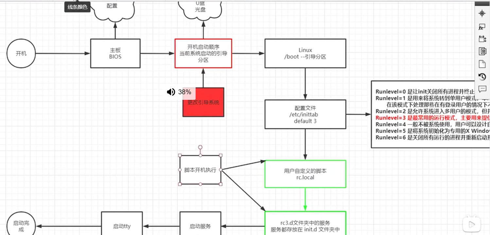

#Linux shell
### shell 内核
关系：shell可以操纵内核
### shell两大主流
- #### sh
  sh：Solaris、hpux默认shell
  bash：Linux系统默认shell （现代的Linux上 sh已经被bash代替 ）
  
- #### csh
  C shell（csh（类似c语音的shell））
  tc shell（tcsh（整合csh 提供更多功能））
### #！/bin/bash
这是解释器声明 即下面编写的shell用/bin/bash程序解释执行
### echo 
echo是一个Shell命令 用来输出变量的值
## shell编程脚本作用
即 写命令
### 脚本的三种调用方式
#### 1、输入脚本的绝对路径或者相对路径
如：/root/helloworld.sh\
但执行的必须是一个可执行文件
#### 2、bash或者sh+脚本
eg：sh helloworld.sh \
当脚本没有x权限时，root和文件所有者通过该方式也可以正常执行\

#### 3、在脚本的路径前面再加“.”或者source、
eg source helloworld.sh

#### 区别
第一种和第二张会新开一个bash，不同bash中的变量无法共享
第三种 是在同一个shell中执行
#### export：可以将当前进程的变量传递给子进程去使用
将来配置profile的时候 所有变量前面必须加export\
变量引用的顺序：首先从当前进程查询变量 如果当前进程没有这个变量 默认去父进程查询这个变量 如果我们用export修饰变量 那么这个变量对于子进程是可见的 

## shell语言
### shell变量
定义变量时，变量名不加美元符号\
规则与其它语言相同
### 字符串
字符串是shell编程中最常见的数据类型 字符串可以用单引号 也可以双引号 也可以不用引号
区别：\
1、单引号内任何字符都会原样输出 单引号字符串的变量是无效的\
2、单引号字串中不能出现单独的一个单引号\
3、双引号里可以有变量\
4、双引号里可以出现转义字符\
echo ${#字符串} 可输出字符串长度 数组同理
### echo ${字符串：a：b}
输出这个字符串从第a位到第b位\
### shell数组
bash支持一维数组（不支持多维） 并且没有限定数组的大小
数组元素下标从0开始编号\
#### 定义
数组名 = （"值1" "值2"...）
#### 读取
x = ￥{数组名[下标]}
#### @
echo ${数组名[@]} 可以获取数组中的所有元素
#### 注释
以#开头的行即是注释 会被解释器忽略

### 算数运算符
expr是一款表达式计算工具 使用它可以完成表达式的求值操作

## 开机启动顺序

